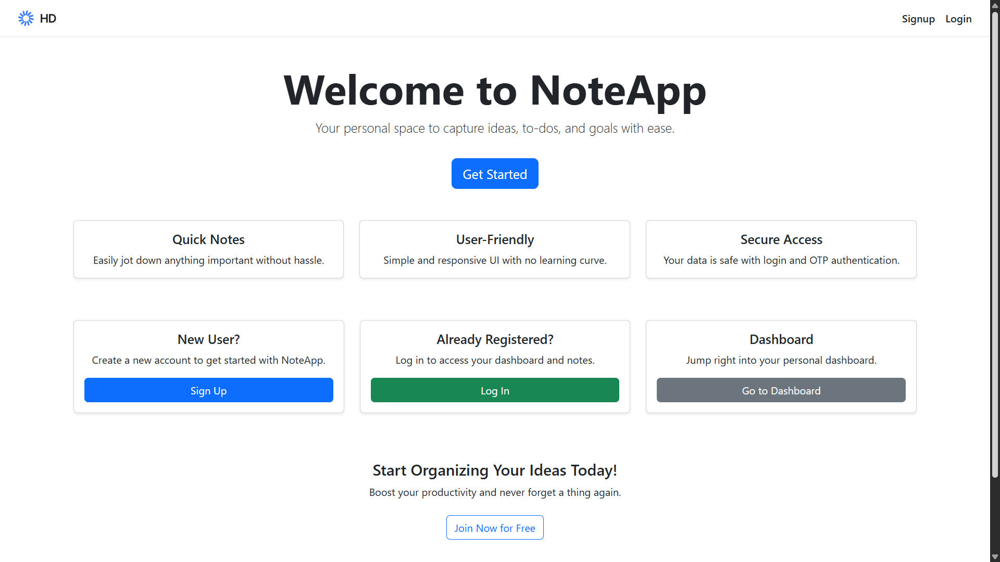
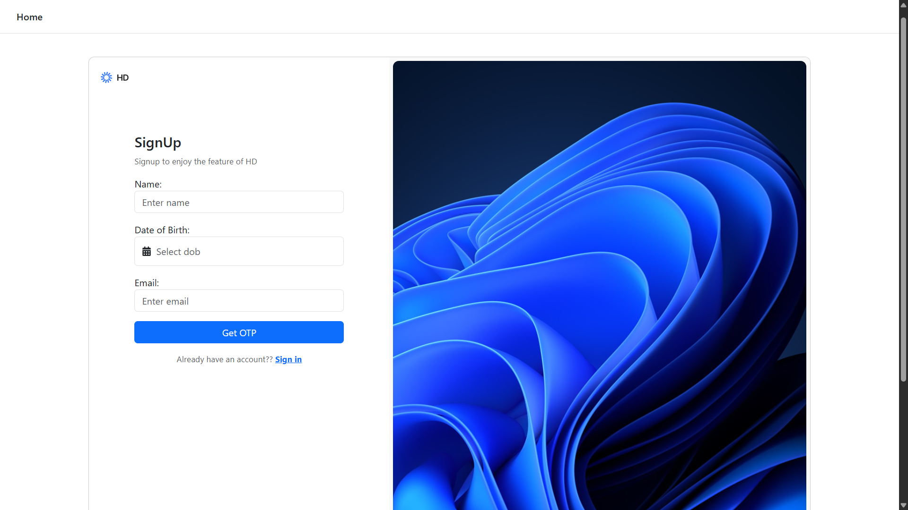
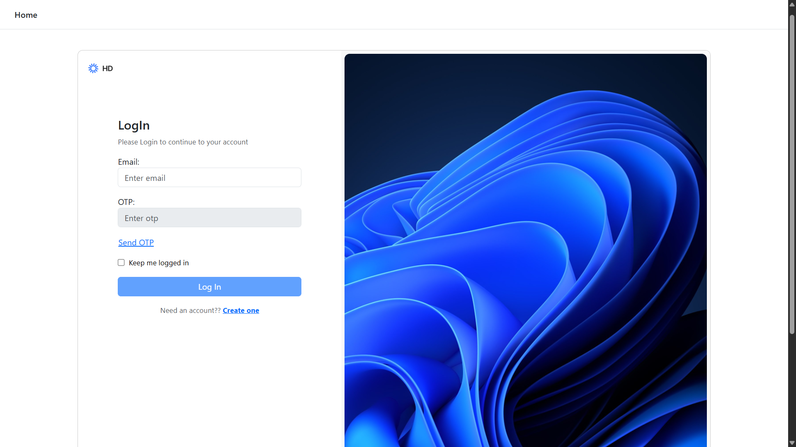
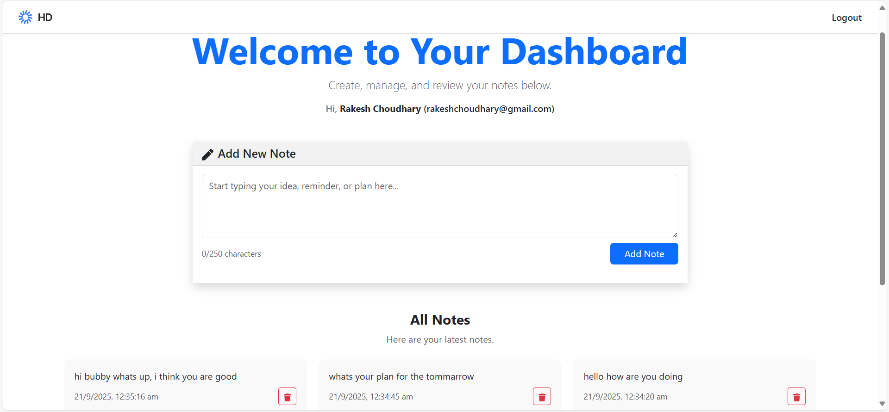
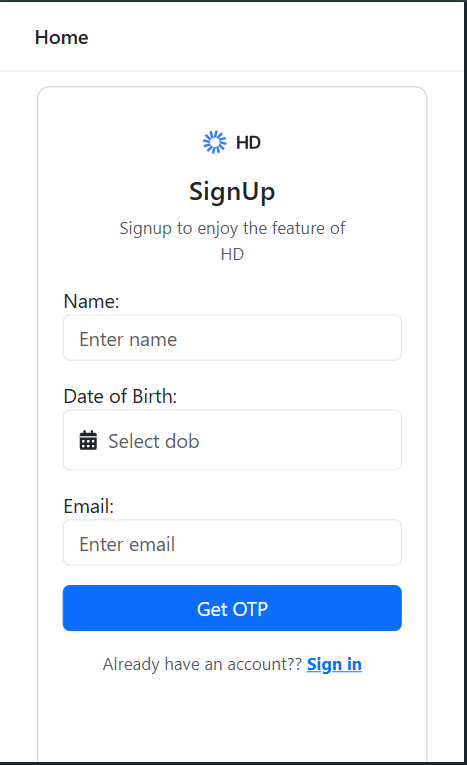

# 📓 HD Notes

> A high-definition note‑taking web app built with the **MERN stack**

---

## 🧩 About The Project

**HD Notes** is a full-stack web application built using **MongoDB**, **Express.js**, **React**, and **Node.js**. It enables users to **create**, **view**, **edit**, and **organize** high-definition notes, with support for **embedded images**.

---

## 🌐 Project Preview

> *(Add preview images inside `./screenShots` and embed them here)*

| Homepage                                   | Signup                                         | Login                                        | Dashboard                                            | Mobile View                                              |
| ------------------------------------------ | ---------------------------------------------- | -------------------------------------------- | ---------------------------------------------------- | -------------------------------------------------------- |
|  |  |  |  | 

---

## ⚙️ Tech Stack

* **MongoDB** – NoSQL database for storing notes and attachments
* **Express.js** – Backend framework for RESTful APIs
* **React** – Frontend UI library
* **Node.js** – Server runtime environment
* **Mongoose** – ODM for MongoDB schemas and queries
* **Concurrently** – Run frontend and backend together in dev mode

---

## 🏗️ Architecture

### 🔹 Backend (`/backend`)

* Express app exposing REST endpoints (`GET /notes`, `POST /notes`, etc.)
* Mongoose models for MongoDB
* Middleware for validation, CORS, and error handling

### 🔹 Frontend (`/frontend`)

* React SPA (built using CRA or Vite)
* Components for:

  * Listing notes
  * Editing/creating notes
  * Searching with tags
  * Uploading images

---

## 📁 Folder Structure

```
/backend
├── models/
├── routes/
├── controllers/
└── app.js

/frontend
├── src/
│   ├── components/
│   ├── pages/
│   └── App.js
└── public/
    └── assets/
```

---

## ✨ Features

* ✅ Create, update, and delete notes
* 🔍 Client-side search and tag filtering
* 🗓️ NoSQL storage using MongoDB
* 📡 RESTful API architecture
* 🖼️ Image upload and preview
* 📱 Responsive design (desktop + mobile)

---

## 🚀 Getting Started

### ✅ Prerequisites

* Node.js (v16+)
* npm or Yarn
* MongoDB (Atlas or local)

---

### 🔧 Backend Environment Variables (`/backend/.env`)

```env
MONGO_URL=your_mongodb_connection_string
JWT_SECRET=your_jwt_secret
EMAIL_USER=your_email_to_send_otp
EMAIL_PASS=your_app_password
```

---

### 🛠️ Setup Instructions

1. **Clone the repository**:

   ```bash
   git clone https://github.com/rakesh-choudhary-01/hd_notes.git
   cd Hd_Notes
   ```

2. **Install backend dependencies**:

   ```bash
   cd backend
   npm install
   ```

3. **Install frontend dependencies**:

   ```bash
   cd ../frontend
   npm install
   ```

4. **Run both servers concurrently** (from project root):

   ```bash
   npm install --save-dev concurrently
   ```

   Root `package.json`:

   ```json
   "scripts": {
     "client": "cd frontend && npm run dev",
     "server": "cd backend && node app.js",
     "dev": "concurrently \"npm run server\" \"npm run client\""
   }
   ```

5. **Start development mode**:

   ```bash
   npm run dev
   node app.js
   ```

---

## 🖼️ How to Add Preview Images

* Save screenshots in `/screenShots`
* Reference them in Markdown like:

  ```markdown
  
  ```

---

## 📬 Contact

**RakeshChoudhary**
[GitHub Profile →](https://github.com/rakesh-choudhary-01)

---

> *Made with ❤️ using the MERN stack.*
